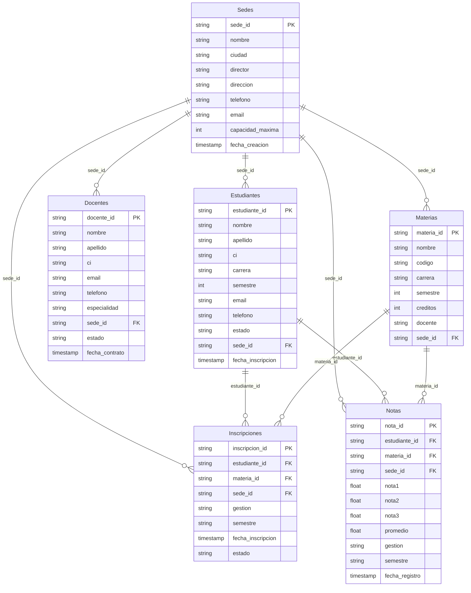
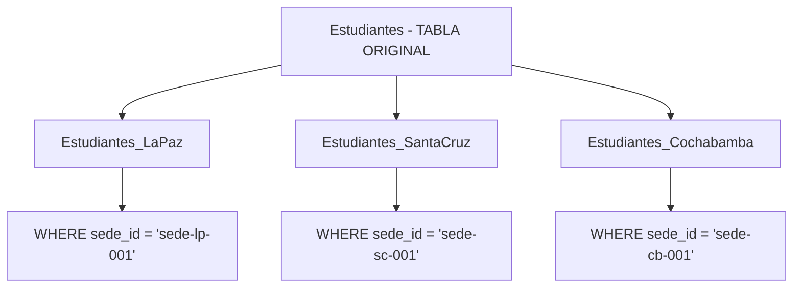
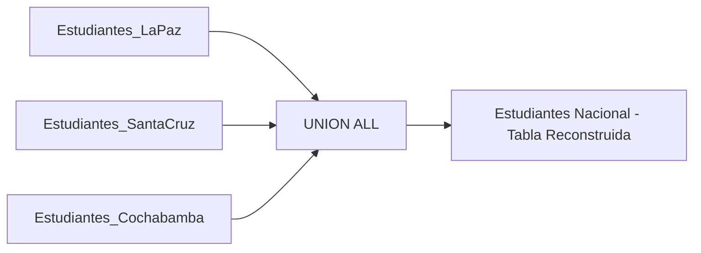
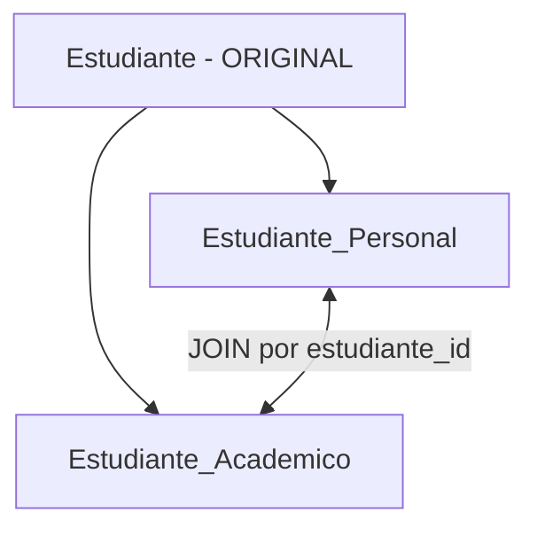
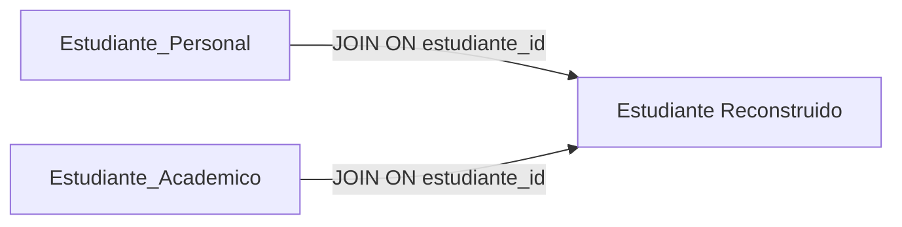

# UniSpanner - Modelo Entidad-Relacion y Fragmentacion

## 1. Modelo Entidad-Relacion (MER) Original

### Tabla Estudiante (SIN fragmentar)

La tabla `Estudiante` contiene TODOS los atributos juntos antes de fragmentar:

```
Estudiante (ORIGINAL)
├── estudiante_id (PK)
├── nombre
├── apellido  
├── ci
├── carrera
├── semestre
├── email
├── telefono
├── estado
├── sede_id (determina la fragmentacion horizontal)
├── fecha_nacimiento
├── direccion
├── genero
├── fecha_registro
├── gestion_ingreso
└── promedio_general
```

### Diagrama ER completo (10 tablas)



---

## 2. Fragmentacion Horizontal

La tabla `Estudiantes` se divide en **3 tablas por sede**, cada una con las mismas columnas pero filas diferentes:



### Esquema de cada fragmento horizontal

Todos tienen las mismas columnas:

```
Estudiantes_LaPaz / Estudiantes_SantaCruz / Estudiantes_Cochabamba
├── estudiante_id (PK)
├── nombre
├── apellido
├── ci
├── carrera
├── semestre
├── email
├── telefono
├── estado
└── fecha_inscripcion
```

### Reconstruccion Horizontal: UNION ALL

```sql
SELECT * FROM Estudiantes_LaPaz
UNION ALL
SELECT * FROM Estudiantes_SantaCruz
UNION ALL
SELECT * FROM Estudiantes_Cochabamba;
```



---

## 3. Fragmentacion Vertical

La tabla `Estudiante` se divide en **2 tablas por tipo de dato**:



### Estudiante_Personal (datos sensibles/personales)

```
Estudiante_Personal
├── estudiante_id (PK)
├── ci
├── fecha_nacimiento
├── telefono
├── direccion
├── email
├── genero
└── fecha_registro
```

### Estudiante_Academico (datos academicos)

```
Estudiante_Academico
├── estudiante_id (PK/FK)
├── nombre
├── apellido
├── carrera
├── semestre_actual
├── sede_id
├── estado
├── gestion_ingreso
└── promedio_general
```

### Reconstruccion Vertical: JOIN

```sql
SELECT p.estudiante_id, p.ci, p.fecha_nacimiento, p.telefono, p.direccion, p.email, p.genero, p.fecha_registro,
       a.nombre, a.apellido, a.carrera, a.semestre_actual, a.sede_id, a.estado, a.gestion_ingreso, a.promedio_general
FROM Estudiante_Personal p
INNER JOIN Estudiante_Academico a ON p.estudiante_id = a.estudiante_id;
```



---

## 4. Tabla Comparativa

| Aspecto | Fragmentacion Horizontal | Fragmentacion Vertical |
|---------|--------------------------|------------------------|
| Criterio de division | Por valores de filas (registros completos en diferentes tablas) | Por columnas (atributos en diferentes tablas) |
| Ejemplo en este sistema | Estudiantes_LaPaz, Estudiantes_SantaCruz, Estudiantes_Cochabamba | Estudiante_Personal, Estudiante_Academico |
| Reconstruccion | `UNION ALL` | `JOIN por clave primaria` |
| Ventaja principal | Consultas locales rapidas (solo se accede a la sede relevante) | Privacidad y seguridad por tipo de dato |
| Desventaja principal | Consultas nacionales requieren UNION de todos los fragmentos | Consultas completas requieren JOIN de las tablas |
| Cuando usar | Cuando los datos se agrupan naturalmente por region o categoria | Cuando diferentes usuarios necesitan diferentes subconjuntos de columnas |
| Integridad referencial | Cada fragmento es independiente y completo | Requiere clave foranea entre fragmentos |

---

## 5. Esquema completo de la base de datos

```
+-------------------+     +-------------------+     +-------------------+
|   Sedes           |     |   Docentes        |     |   Materias        |
|-------------------|     |-------------------|     |-------------------|
| sede_id (PK)      |     | docente_id (PK)   |     | materia_id (PK)  |
| nombre            |     | nombre            |     | nombre           |
| ciudad            |     | apellido          |     | codigo           |
| director          |     | ci                |     | carrera          |
| direccion         |     | email             |     | semestre         |
| telefono          |     | telefono          |     | creditos         |
| email             |     | especialidad      |     | docente          |
| capacidad_maxima  |     | sede_id (FK)      |     | sede_id (FK)     |
| fecha_creacion    |     | estado            |     |                   |
+-------------------+     | fecha_contrato    |     +-------------------+
          |               +-------------------+               |
          |                        |                         |
          +----------+-------------+----------+--------------+
                     |                        |
                     v                        v
          +-------------------+     +-------------------+
          | Inscripciones     |     | Notas             |
          |-------------------|     |-------------------|
          | inscripcion_id(PK|     | nota_id (PK)      |
          | estudiante_id(FK)|     | estudiante_id(FK) |
          | materia_id (FK)   |     | materia_id (FK)   |
          | sede_id (FK)      |     | sede_id (FK)      |
          | gestion           |     | nota1             |
          | semestre          |     | nota2             |
          | fecha_inscripcion |     | nota3             |
          | estado            |     | promedio          |
          +-------------------+     | gestion           |
                                    | semestre          |
                                    | fecha_registro    |
                                    +-------------------+

Fragmentacion Horizontal:
+-------------------------+ +--------------------------+ +----------------------------+
| Estudiantes_LaPaz       | | Estudiantes_SantaCruz    | | Estudiantes_Cochabamba     |
|-------------------------| |--------------------------| |----------------------------|
| estudiante_id (PK)      | | estudiante_id (PK)       | | estudiante_id (PK)         |
| nombre, apellido, ci    | | nombre, apellido, ci     | | nombre, apellido, ci       |
| carrera, semestre       | | carrera, semestre        | | carrera, semestre          |
| email, telefono         | | email, telefono          | | email, telefono            |
| estado                  | | estado                   | | estado                     |
| fecha_inscripcion       | | fecha_inscripcion        | | fecha_inscripcion           |
+-------------------------+ +--------------------------+ +----------------------------+

Fragmentacion Vertical:
+-------------------------+ +--------------------------+
| Estudiante_Personal     | | Estudiante_Academico     |
|-------------------------| |--------------------------|
| estudiante_id (PK)      | | estudiante_id (PK/FK)    |
| ci                      | | nombre                   |
| fecha_nacimiento        | | apellido                 |
| telefono                | | carrera                  |
| direccion               | | semestre_actual          |
| email                   | | sede_id (FK)             |
| genero                  | | estado                   |
| fecha_registro          | | gestion_ingreso          |
|                         | | promedio_general         |
+-------------------------+ +--------------------------+
```